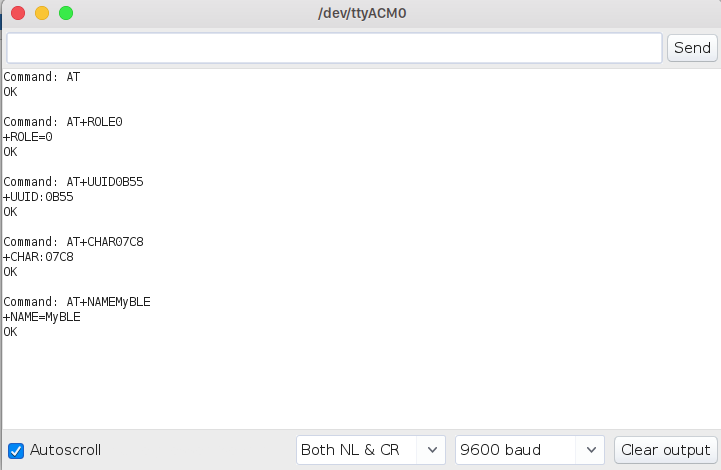

# AtSerialCommunicator
Serial communicator is able to send AT commands from Arduino Leonardo-like devices (SparkFun Pro Micro, Fio v3) to a AT command supported device (AT-09, HC-05, ESP8266, etc.). According to documentation on Arduino's website "Arduino Leonardo board uses **Serial1** to communicate via TTL (5V) serial on pins 0 (RX) and 1 (TX). **Serial** is reserved for USB CDC communication."

## How to run
1. Clone git repo
2. Open project in Arduino IDE
3. Connect arduino-like device
4. Open serial monitor
5. Set bound rate to device's default
6. Type supported AT command

Note: you don't need to take care about new line characters.

## Hook-up example

| Pro Micro        |AT-09           |
| -----------------|:---------------:|
| VCC      |  VCC |
| GND      |  GND |
| RXI |   TXD    | 
| *TXO |   *RXD    | 

\* Over voltage devider or level shifter.

## Communication example

